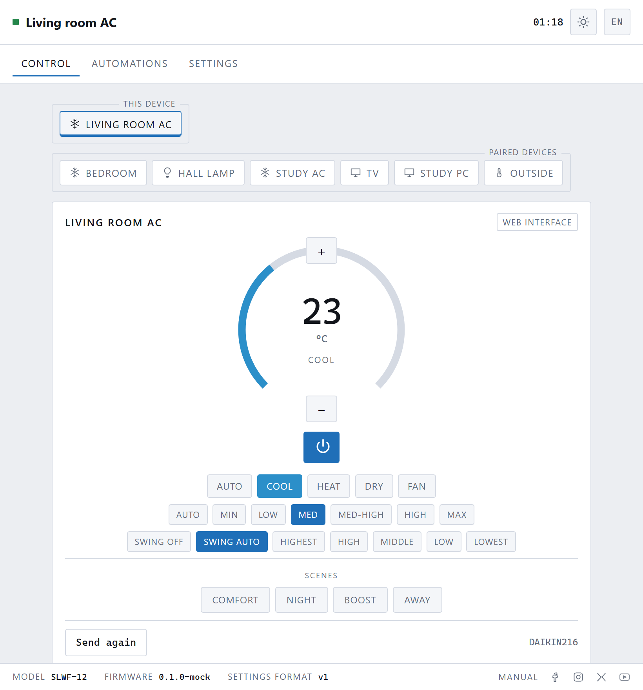

# SLWF-12 AC Bridge

Firmware that turns an **SLWF-12** (ESP8266 / ESP-12F with an IR receiver and
an IR emitter) into a universal air-conditioner bridge: control your AC from
Home Assistant, MQTT, Telegram, a browser, a serial host, a schedule — or from
its own original remote, with every one of those staying in sync.

Written for the Arduino framework, built with PlatformIO.



*Teaching it: one press of your existing remote, one question, done. From then
on the bridge can build any command by itself — including combinations you
never demonstrated.*

**New here?** Start with the **[user manual](docs/README.md)** — written for
somebody who just wants their air conditioner on their phone.

---

## What it does

| | |
|---|---|
| **Learns your AC in one button press** | If the remote's protocol is one of the ~60 [IRremoteESP8266](https://github.com/crankyoldgit/IRremoteESP8266) knows, the bridge can *synthesise* every command from then on — including combinations you never demonstrated. |
| **Falls back gracefully** | Unknown protocol? It sweeps every protocol it knows, asking you whether the unit reacted. Still nothing? It records raw captures state by state. |
| **Home Assistant, no YAML** | Announces itself over MQTT discovery as a `climate` entity, plus a signal-strength sensor and a resend button. |
| **Watches your own remote** | Somebody presses the original remote; the bridge hears it, decodes it, and updates every other client. Nothing goes stale. |
| **Many clients, one API** | Web UI, REST, MQTT, Telegram, UART, schedules and the hardware button all go through the same internal command bus, and each can be switched off individually. |
| **Standalone timers** | Daily rules and countdowns run on the device, so it keeps working when the network does not. |
| **Scenes** | Named one-tap presets, partial or complete, exposed to the web card, Telegram buttons and a Home Assistant dropdown. |
| **Protects the compressor** | A start requested too soon after a stop is held, not refused, until the minimum off period has passed. |
| **Counts its own running time** | Runtime, starts and an energy estimate, published as Home Assistant sensors. |
| **Light and dark** | Follows the system by default; pin either with one button or a `?theme=` link. |
| **Multilingual** | English and Ukrainian shipped; adding a language is one JSON file and no code change. |
| **Automations** | Visual IF/THEN rules across every paired device, with hold times, wait steps, else branches and a runaway guard. |
| **Sunrise and sunset** | Computed on the device from a latitude and longitude — no network, and agrees with NOAA's own algorithm to within a minute. |
| **Other devices** | Other SLWF units, WLED controllers, ESPHome devices, Wake-on-LAN targets and JSON sensors, all described by `web/devicetypes.json` rather than by code. |
| **Off by default** | Every integration ships switched off. The device opens no outbound connection unless somebody presses a button that says it will. |
| **Updatable** | Web upload, PlatformIO OTA, or a plain-HTTP URL. |
| **MCP server** | `tools/mcp/` lets an AI assistant drive it through the same REST API, with a read-only mode. Runs on your machine, not on the device. |

---

## Hardware

SLWF-12 r1.0, per `hw/SLWF-12.pdf`:

| Function | Net | ESP-12F pin | GPIO | Circuit |
|---|---|---|---|---|
| IR receiver output | `GPIO4` | 19 | **GPIO4** | J2 pin 1; supply through R13 220 Ω + C7 100 nF |
| IR emitter | `GPIO16` | 4 | **GPIO16** | Q3 (BSS138) → LED1 through R12 220 Ω |
| Alternate IR driver | `IR_Write` | 7 | GPIO13 | Q2 (BSS138) → pad P2 |
| Button | `GPIO0` | 18 | **GPIO0** | U6 to ground, R7 pull-up |
| Console / UART client | `RXD0`/`TXD0` | 21/22 | GPIO3/GPIO1 | CH340N (U5) and header P1 |
| Appliance UART | `Tx/Rx-Esp-Control` | 6/5 | GPIO12/GPIO14 | level-shifted to header P1 |

> **Note on GPIO16.** It is driven through the RTC domain rather than the normal
> GPIO block, so each edge costs about a microsecond more than on other pins.
> `IRsend` calibrates for this at start-up and it works, but if your unit
> ignores commands, move the emitter to the alternate driver on GPIO13 (pad P2)
> and change the pin under **System → Pin assignment**. Every pin is
> configurable at runtime; nothing needs recompiling.

The board's own UART on GPIO12/GPIO14 is not used by this firmware — it is the
appliance-side port on the original SLWF product. The UART *client* here talks
over UART0, the same port as the USB console.

---

## Getting started

### 1. Flash

```bash
git clone https://github.com/smlight-tech/ir-remote-control.git
cd ir-remote-control
pio run -t upload          # firmware
pio run -t uploadfs        # web interface, language packs
```

Or flash a prebuilt image from the
[releases](https://github.com/smlight-tech/ir-remote-control/releases).

**One file, for a new device:**

```bash
esptool.py --chip esp8266 --port COM3 --baud 921600 write_flash \
  --flash_mode dio --flash_size 4MB --flash_freq 40m \
  0x000000 slwf12-factory.bin
```

**Two files, if you want to update one part without the other:**

```bash
esptool.py --chip esp8266 --port COM3 --baud 921600 write_flash \
  --flash_mode dio --flash_size 4MB --flash_freq 40m \
  0x000000 firmware.bin \
  0x200000 littlefs.bin
```

| Image | Offset | What it is |
|---|---|---|
| `slwf12-factory.bin` | `0x000000` | both of the below, plus the blank gap between them — 4 MB |
| `firmware.bin` | `0x000000` | eboot bootloader **plus** the application |
| `littlefs.bin` | `0x200000` | web interface and language packs |

All three are produced by every `pio run` — see `tools/package.py`. The merged
one can also be built on its own with `python tools/factory_image.py`.

#### Telling test builds apart

The canonical names above stay put, because `pio run -t upload`, the OTA target
and the merge all look for them there. Alongside them, each build that produces
something new is copied into `dist/` under a name that identifies it:

```
dist/slwf12-20260805-100819-1.2.0-firmware.bin
dist/slwf12-20260805-100819-1.2.0-littlefs-1223f911.bin
dist/slwf12-20260805-100819-1.2.0-factory.bin
```

The timestamp comes first, and is fixed width, so sorting the folder by name
sorts it by age — which is the whole point of naming them. With the version in
front, `1.10.0` sorts between `1.1.0` and `1.2.0` and the newest build could be
anywhere.

It also earns its place over the version. `git describe` returns the same
string for every uncommitted edit — `1.2.0-dirty` all afternoon — so the
version alone cannot tell two test builds apart. The trailing digest on the
filesystem image is the interface build from `manifest.json`, which is how you
see at a glance whether the web files actually changed.

A build with nothing new to say copies nothing, so an unchanged rebuild does
not leave another four megabytes behind. The twelve most recent builds are
kept and the rest are pruned. `dist/` is not in version control.

#### Why two images at all

The ESP8266 has no partition table and no separate bootloader file — both are
ESP32 concepts. `elf2bin` prepends `eboot.elf` (the stub that makes OTA
possible) to the application, so `firmware.bin` is complete on its own and goes
at offset zero.

The application and the filesystem are not adjacent: the app ends below 1 MB,
LittleFS starts at `0x200000`, and the ~1.25 MB between them is the OTA staging
area that eboot writes an incoming update into. A merged image therefore has to
carry that gap as blank flash, which is why it is 4 MB for 2.8 MB of content.

They are also deliberately separate for updates: **an OTA firmware update must
not touch the filesystem**, because your configuration, Wi-Fi credentials and
learned IR codes live there. Reflashing `littlefs.bin` erases all of it.

The offsets are not written down in the build scripts — `tools/factory_image.py`
reads `_FS_start` and `_FS_end` out of the linked ELF, so changing
`board_build.ldscript` cannot silently produce a wrong image.

`littlefs.bin` is optional for booting — without it the device serves a plain
page telling you to upload it. If the chip previously ran a different flash
layout, run `esptool.py erase_flash` first; the SDK writes its own RF
calibration defaults on the next boot, so there is no `esp_init_data` image to
flash by hand.

### 2. Join it to Wi-Fi

On first boot the device raises an open access point called
**`SLWF-12 setup <chipid>`**. Join it; the captive portal opens by itself.
Pick your network, enter the password, done. If the router later disappears the
device keeps retrying in the background *and* re-raises the portal, so it is
never stranded.

Afterwards it is at `http://slwf12-<chipid>.local/`.

### 3. Teach it your air conditioner

Open **Teach → Identify my remote**, point your AC remote at the device and
press any button.

- **Recognised** → the bridge sends that same command straight back. If the AC
  reacts, say yes and you are finished. It can now build every command itself.
- **Not recognised** → try **every protocol**: the bridge sends a test command
  with each one in turn and you say which made the unit beep.
- **Still nothing** → **record raw codes**. Pick the modes and temperature
  range you actually use; the bridge walks you through setting the remote to
  each combination and pressing send.

You can also skip learning entirely by importing a profile from the
[shared database](codes/README.md), or by choosing the protocol by hand.

### 4. Connect it to things

**Home Assistant** — Clients → MQTT: broker address, credentials, leave
discovery on. The thermostat appears by itself.

**Telegram** — create a bot with [@BotFather](https://t.me/BotFather), paste
the token, save, then send `/start` to your bot. The first person to do so
becomes the owner and the door closes behind them.

---

## The architecture, briefly

```
IR receiver ─┐                                     ┌─► IR transmitter
MQTT ────────┤                                     ├─► MQTT state + HA discovery
Telegram ────┼──►   bus::CommandBus   ─────────────┼─► WebSocket push
Web / REST ──┤      gates · clamps ·               ├─► Telegram notice
UART ────────┤      transmits · notifies           └─► UART event
Button ──────┤
Schedules ───┘
```

Every client builds an `ac::Delta` — a partial state change — and hands it to
`CommandBus::apply()` along with its `src::Source`. The bus decides whether
that source is allowed, clamps the values to what the AC supports, transmits
over IR unless the change *came* from IR, and fans the result out to every
subscriber. No adapter talks to another.

Adding a client (Matter, Zigbee, a physical panel, an HTTP webhook) means
writing one adapter against that one class. See `src/main.cpp` — the wiring is
fifteen lines and all of it is in one function.

Internally the AC state *is* IRremoteESP8266's `stdAc::state_t`, so a frame
decoded from your remote and a frame synthesised for the AC share one
representation with no lossy conversion between them. Externally everything
speaks Home Assistant's climate vocabulary (`cool`, `fan_only`, `medium_high`),
so the MQTT integration needs no translation table anywhere.

---

## REST API

Everything the UI does, the API does. Bearer token or HTTP basic auth once
access control is switched on.

```bash
TOKEN=…                                   # System → Access control
BASE=http://slwf12-a1b2c3.local

curl $BASE/api/state
curl -H "Authorization: Bearer $TOKEN" -X POST $BASE/api/state \
     -d '{"hvac_mode":"cool","temp":23,"fan":"low"}'
curl -H "Authorization: Bearer $TOKEN" -X POST $BASE/api/resend -d '{}'
```

| Method | Path | Purpose |
|---|---|---|
| GET | `/api/status` | everything: device, network, AC, IR counters, learning |
| GET / POST | `/api/state` | read / change the air-conditioner state |
| POST | `/api/resend` | retransmit the current state |
| GET / POST | `/api/config` | settings (secrets redacted on read) |
| GET | `/api/wifi/scan` · POST `/api/wifi/connect` | Wi-Fi |
| GET | `/api/learn` · POST `/api/learn/{start,confirm,skip,cancel}` | learning wizard |
| GET | `/api/protocols` | every protocol the firmware can synthesise |
| GET | `/api/codes` · GET/POST `/api/code` · POST `/api/code/delete` | learned raw codes |
| GET / POST | `/api/schedules` | timers and daily rules |
| GET / POST | `/api/scenes` · POST `/api/scenes/apply` | named presets |
| POST | `/api/stats/reset` | clear the runtime counters |
| GET | `/api/ir/last` · POST `/api/ir/send` | diagnostics and arbitrary transmission |
| GET | `/api/metrics` | Prometheus exposition |
| GET | `/api/log` | ring-buffer log |
| POST | `/api/ota/upload` · `/api/ota/url` | updates |

A WebSocket at `/ws` pushes `state`, `learning`, `log` and `notice` messages.

---

## MQTT topics

Base topic defaults to `slwf12/<chipid>`.

| Topic | Direction | Payload |
|---|---|---|
| `…/availability` | out, retained | `online` / `offline` (also the LWT) |
| `…/state` | out, retained | full JSON state + `source`, `rssi`, `uptime` |
| `…/mode/state`, `…/power/state`, `…/temperature/state`, `…/fan/state`, `…/swing/state` | out | plain text mirrors |
| `…/set` | in | JSON partial state, e.g. `{"hvac_mode":"heat","temp":21}` |
| `…/mode/set`, `…/power/set`, `…/temperature/set`, `…/fan/set`, `…/swing/set` | in | bare values (what Home Assistant sends) |
| `…/scene/set` | in | a scene name |
| `…/resend` | in | anything; retransmits |

Discovery publishes a `climate` entity plus a `select` for scenes, `sensor`s for
signal strength, runtime and (when the rated power is set) estimated energy, and
a `button` that retransmits — under
`homeassistant/climate|select|sensor|button/<id>/…`.

---

## UART protocol

Enable under **Clients → UART**. While enabled the logger stops writing to the
port so the framing stays clean.

```
> {"cmd":"set","hvac_mode":"cool","temp":23}
< {"event":"state","source":"uart","revision":8,"state":{…}}

> off
< {"event":"state",…}

> status
< {"event":"status","device":{…},"network":{…},…}
```

Bare words (`on`, `off`, `temp 24`, `mode cool`, `fan auto`, `status`,
`resend`, `help`) work too, for when you have a terminal open rather than a
program attached. State changes from other clients arrive unprompted as
`{"event":"changed",…}`.

---

## The hardware button (GPIO0)

| Gesture | Effect |
|---|---|
| click | toggle the air conditioner |
| double click | start the identify wizard |
| hold 3 s | raise the Wi-Fi setup access point |
| hold 10 s | factory reset, then restart |

---

## Building

```bash
pio run -e slwf12               # firmware
pio run -e slwf12 -t buildfs    # web UI image (web/ is gzipped into data/)
pio run -e slwf12-debug         # verbose logging
pio run -e slwf12-ota -t upload --upload-port 192.168.1.50
```

`tools/build_web.py` gzips `web/` into `data/` before the filesystem image is
built, so `data/` is generated and not committed. `tools/gen_version.py` writes
`include/generated/version.h` from `git describe`.

### Working on the interface without an ESP8266

```bash
python tools/mock_server.py      # then open http://localhost:8080
```

Serves `web/` from source behind a fake device that answers every endpoint the
interface calls. It is a behavioural mock, not a stub: the learning wizard
really advances through its phases, a simulated remote changes the state behind
your back every minute or so — which is what exercises the live-update path —
and the log streams over a real WebSocket. Secrets come back with the same
redaction sentinel the firmware uses, so the "unchanged password" path is
covered too.

Stdlib only, nothing to install. Edit a file under `web/`, reload, done.

The documentation images are captured from this same mock, so they can never
drift from the real thing — see [docs/README.md](docs/README.md).

| Flag | |
|---|---|
| `--port N` | listen elsewhere (default 8080) |
| `--latency MS` | delay every response, to feel what Wi-Fi feels like |
| `--unconfigured` | start with no air conditioner, to see the first-run flow |
| `--no-remote` | stop the simulated remote from changing the state |

### Memory, and why some things are the way they are

Measured on this build:

```
RAM    60.8%   49,772 of 81,920 bytes static (.data + .rodata + .bss)
Flash  76.0%  793,977 of 1,044,464 bytes
```

That leaves roughly 30 kB of DRAM for heap and stack before the SDK takes its
share — and this firmware runs an async web server, a WebSocket, an MQTT
client, a 2 kB IR capture buffer and, if you enable it, a TLS session in what
remains. Consequences worth knowing:

- **lwIP is built in low-memory mode** (`v2_low_memory`), trading throughput for
  about 10 kB of heap.
- **Telegram holds one TLS connection open and long-polls it.** Opening a fresh
  connection per poll — what most bot libraries do — costs seconds of CPU per
  handshake on this part.
- **Telegram is the tightest fit, and it may not fit.** A TLS 1.2 record can
  legally reach 16 kB and the *server* picks the size, so without fragment
  negotiation that is what has to be reserved. The client probes
  `probeMaxFragmentLength` once per boot: if Telegram agrees to 512-byte
  fragments the session costs about 7 kB, and if it does not the session needs
  roughly 23 kB and will likely be refused. When that happens the reason is
  reported verbatim in the log and in `GET /api/status` → `telegram.lastError`,
  with the actual free heap alongside it. You can force a smaller buffer with
  `telegram.tlsBufferBytes` — but that trades correctness for memory, and a
  record larger than the buffer drops the connection.
- **The full IRremoteESP8266 protocol set is mandatory, not a choice.** `IRac`
  references every protocol class, so `_IR_ENABLE_DEFAULT_=false` fails to
  link. That is what puts flash at 76% and it is also what gives the device its
  model coverage.
- **The device never fetches the profile database itself.** The browser does it
  and pushes codes down one at a time. A full raw profile is tens of kilobytes
  of JSON — more than the device has.

---

## Repository layout

```
src/core/     state model, settings, command bus, logging
src/ir/       capture, transmission, code storage, learning wizard
src/net/      Wi-Fi, web server, REST, MQTT, Telegram, OTA
src/io/       UART client, hardware button
src/app/      scheduler and NTP
web/          the interface (no build step, gzipped at flash time)
codes/        shared profile database
tools/        PlatformIO pre-build scripts and CI checks
hw/           schematic
```

---

## How this differs from the SLWF-01 Pro

Both are SMLIGHT air-conditioner bridges, and they solve the same problem from
opposite ends.

The **SLWF-01 Pro** plugs into the service connector *inside* the unit and
speaks its native serial protocol — so it is two-way: it reads the machine's
real state and its own sensors instead of inferring them. It only works with
units that have that port.

The **SLWF-12** is infrared. It sits in the room and sends what the handset
sends, so it works with almost any air conditioner ever made, including every
one already installed and out of warranty. The cost is that infrared is
one-way: it knows what it last sent, plus whatever it overhears when somebody
uses the original remote.

| | SLWF-01 Pro | SLWF-12 |
|---|---|---|
| Link | Wired, internal service port | Infrared, line of sight |
| Fitting | Open the unit | Plug in, aim |
| Compatibility | Units with a compatible port | Almost anything with a remote |
| Knows the real state | Yes, it asks | Last sent, plus what it overheard |
| Unit's own sensors | Yes | No — infrared does not carry them back |

If your unit has the port, use the 01 Pro. If it does not, that is what this is
for. They coexist happily: an SLWF-12 can pair with an SLWF-01 over the network
and show both on one page.

## Documentation

- **[User manual](docs/README.md)** — written for somebody who just wants their
  air conditioner on their phone. Every screenshot is captured from the running
  interface by `tools/screenshots.py`.
- [Shared profile database](codes/README.md)

## Contributing

Profiles for new air-conditioner models are the most useful thing you can
contribute — see [codes/README.md](codes/README.md). Translations are a single
file in `web/lang/`. Everything else: [CONTRIBUTING.md](CONTRIBUTING.md).

## Licence

**GNU General Public License v3.0** — see [LICENSE](LICENSE).

The whole repository is covered: firmware, web interface, and the tools. If you
distribute a device running this, or a modified version of it, the people you
give it to are entitled to the source of what you gave them, under the same
licence.

The dependencies are all compatible with GPL-3:

| | |
|---|---|
| [IRremoteESP8266](https://github.com/crankyoldgit/IRremoteESP8266) | LGPL-2.1 |
| [ESPAsyncWebServer / ESPAsyncTCP](https://github.com/esphome/ESPAsyncWebServer) | LGPL-3.0 |
| [ArduinoJson](https://arduinojson.org/) | MIT |
| [PubSubClient](https://github.com/knolleary/pubsubclient) | MIT |
| [modbus-esp8266](https://github.com/emelianov/modbus-esp8266) | BSD-3-Clause |
| ESP8266 Arduino core | LGPL-2.1 |

Built on IRremoteESP8266 by David Conran and contributors, which is where the
real protocol knowledge lives.
