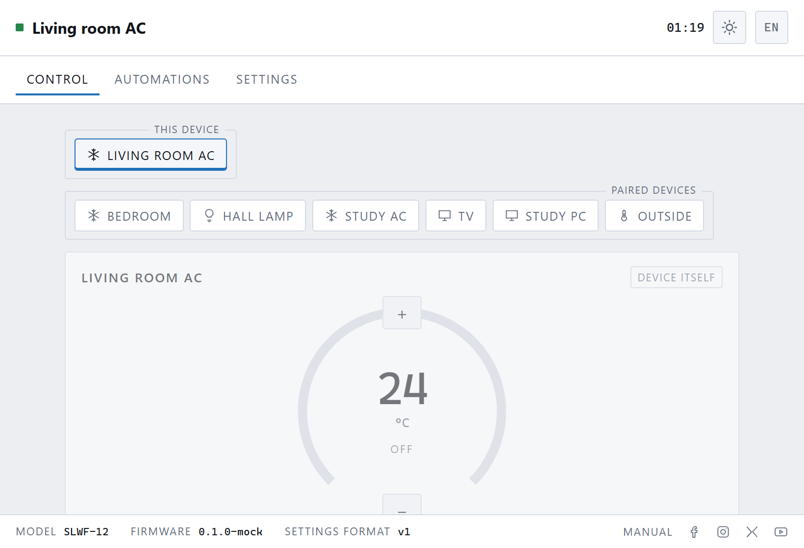
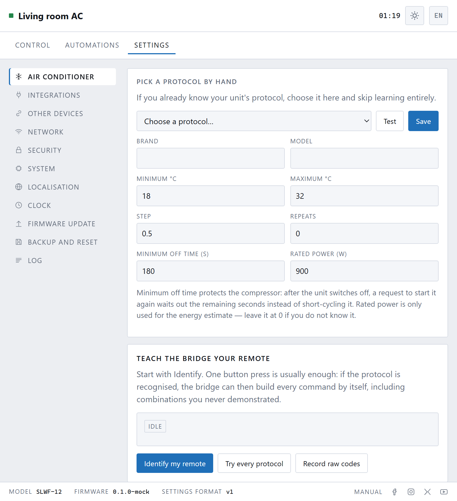

[← the manual](README.md) · **1. First run** · [2. Teaching →](02-teaching.md)

# First run

Ten minutes, most of it waiting.

## What you need

- The SLWF-12 and a USB power supply — any phone charger will do.
- Your Wi-Fi name and password. **It must be a 2.4 GHz network.** The box cannot
  see 5 GHz networks at all; if your router presents both under one name that is
  usually fine, but a network named something like "MyHouse-5G" will not appear.
- Your air conditioner's remote control, with working batteries.

## 1. Where to put it

Somewhere it can **see the air conditioner**, and somewhere the **remote can see
it**.

Infrared is light. It does not go through walls, around corners, or through the
back of a bookcase. It does bounce off white walls and ceilings surprisingly
well, so it does not have to be a straight line — but it does have to be a line.

Three or four metres, pointing at the unit, is comfortable. On top of a shelf or
a cupboard is ideal. Inside a drawer is not.

## 2. Power it on

Plug it in. After a few seconds it creates a Wi-Fi network of its own, called

    SLWF-12 setup a1b2c3

where the letters and numbers are unique to your box.

## 3. Join its network

On a phone or laptop, open the Wi-Fi list and join **SLWF-12 setup …**.

A setup page should open by itself. If it does not, open a browser and go to

    http://192.168.4.1

Your phone may warn you that this network has no internet. It has not — that is
the point. Choose "stay connected".

## 4. Tell it your Wi-Fi

Pick your network from the list and type the password. The box restarts, joins
your Wi-Fi, and its own setup network disappears — which will drop your phone
back onto your normal Wi-Fi, usually by itself.

## 5. Find it again

The box is now on your network at

    http://slwf12-a1b2c3.local

using the same letters and numbers as before. That address works on most phones
and computers. If it does not, your router's list of connected devices will show
its address, something like `192.168.1.50`.

Bookmark it. This is the page from now on.

## 6. Teach it your remote

The page will say it does not know your air conditioner yet, with a button that
takes you straight to it.

This is the one step that cannot be skipped, and it is the subject of the
[next chapter](02-teaching.md).

---

## If something goes wrong

**The setup network never appeared.** Give it a full minute. If it still has not,
hold the button on the box for about five seconds until it restarts, and watch
again.

**It joined the Wi-Fi but you cannot find it.** Look in your router's device
list for a name starting with `slwf12-`. If it is not there, the password was
probably wrong or the network is 5 GHz; hold the button on the box for **ten
seconds** to clear its settings and start over.

**You want to start completely fresh.** Hold the button for ten seconds. That
erases the Wi-Fi details, the taught air conditioner, and everything else.

More in [When something is wrong](09-troubleshooting.md).

---

Next: **[Teaching it your air conditioner →](02-teaching.md)**
