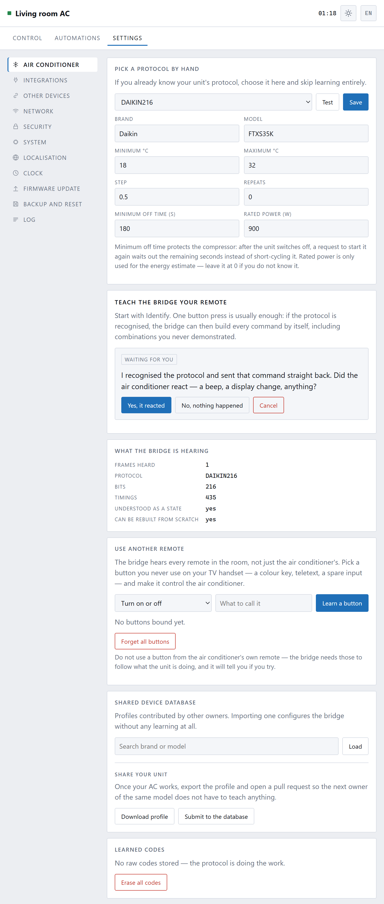

[← 1. First run](01-first-run.md) · **2. Teaching** · [3. Everyday use →](03-everyday-use.md)

# Teaching it your air conditioner

The box knows how to send infrared. It does not yet know what *your* air
conditioner expects to hear — every manufacturer speaks its own dialect. This
chapter fixes that, once, and then you never think about it again.

Go to **Settings → Air conditioner**.

There are three ways to do it, and they are in the order you should try them.

---

## Way 1: pick your protocol from the list

**Try this first.** It takes five seconds and works for most units.

Look at your remote, or the label inside the air conditioner's front flap, for a
brand: Daikin, Mitsubishi, Gree, Midea, Samsung, LG, Panasonic, Toshiba, Haier
and about fifty others are all in the list.

1. Choose the closest match in **Pick a protocol by hand**.
2. Press **Test**. The air conditioner should beep, or the display should
   change.
3. If it responded, press **Save**. You are done.

Some brands have several entries — `DAIKIN`, `DAIKIN2`, `DAIKIN216` and so on.
These are genuinely different models, not versions of the same thing. Work down
them with **Test** until one gets a response.

Nothing is broken if you guess wrong. A protocol your unit does not understand
is simply ignored.

### The other fields on that card

| | |
|---|---|
| **Brand, Model** | For your own reference, and included if you share the profile |
| **Minimum / Maximum °C** | The range the page will let you ask for |
| **Step** | How much one press of + or − moves. Half a degree by default |
| **Repeats** | Send each command more than once. Leave at 0 unless commands go astray |
| **Minimum off time** | Compressor protection — see below |
| **Rated power** | Only used for the energy estimate. Leave at 0 if you do not know it |

**Minimum off time** is worth understanding. An air conditioner switched off and
immediately back on can damage its compressor, because the pressure has not
equalised. The number here — 180 seconds is a sensible default, check your
manual — is how long the box will refuse to restart the unit. It does not throw
the request away: it holds it, tells you how long is left, and then does it.

---

## Way 2: let it identify your remote

If your brand is not in the list, or none of them got a response, let the box
listen.

1. Press **Identify my remote**.
2. Point the remote at the box and press its **power** button once.

That is usually the whole thing. Air conditioner remotes do not send "power on"
— they send the *entire state* of the unit in every press: mode, temperature,
fan, swing, timer, everything. So one press is often enough for the box to
recognise the dialect and work out how to say anything else in it, including
combinations you never demonstrated.

The card tells you what it heard:

| | |
|---|---|
| **Protocol** | Which dialect it recognised |
| **Understood as a state** | Whether it could read the settings out of the message |
| **Can be rebuilt from scratch** | Whether it can now compose new commands by itself |

If both say **yes**, you are finished. Press Save and go and use it.

### If identify does not recognise it

Press **Try every protocol**. The box will send a test command in each dialect
it knows and ask you, after each one, whether the air conditioner reacted. It
takes a few minutes and needs you in the room, but it finds units that identify
alone cannot.

---

## Way 3: record the raw codes

For the rare unit that no protocol matches.

Press **Record raw codes**, and the box walks you through pressing buttons on
your remote one at a time — off, then cool at each temperature, and so on. It
stores the exact signal for each one and plays it back later, like a parrot.

This always works. It has two costs: it only knows the exact combinations you
recorded, and the recording takes twenty minutes of pressing buttons.

Use it only when the first two ways have failed.

---

## The shared database

Further down the page is **Shared device database** — profiles that other owners
have contributed. If somebody with your model has already done the work, you can
load their profile and skip teaching altogether.

Searching it asks your **browser** to fetch the list from the project's page on
GitHub. The box itself never contacts anything. Nothing about your device is
sent by looking.

Once your air conditioner works, **Download profile** gives you a small file,
and **Submit to the database** opens a page where you can offer it to the next
owner of the same model. Nothing is uploaded automatically, and the profile
contains the protocol and the temperature range — no Wi-Fi details, no
passwords, nothing about your home.

---

## Checking it worked

Go back to **Control** and press the power button. The air conditioner should
respond.

If it does not, [When something is wrong](09-troubleshooting.md) has the short
list of causes, of which "it is not pointing at the unit" is the most common by
a distance.

---

Next: **[Everyday use →](03-everyday-use.md)**
