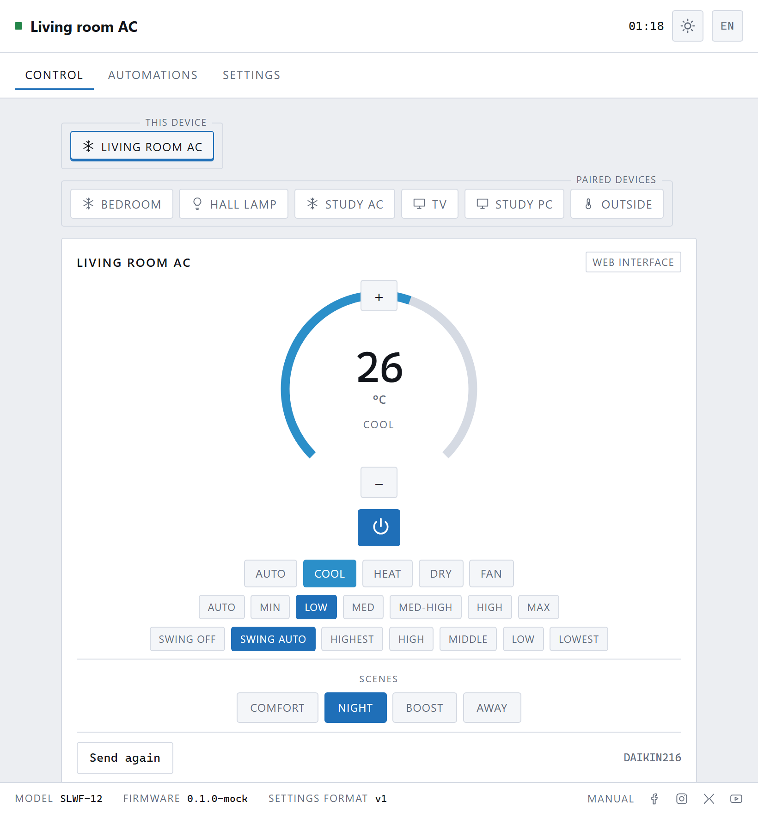
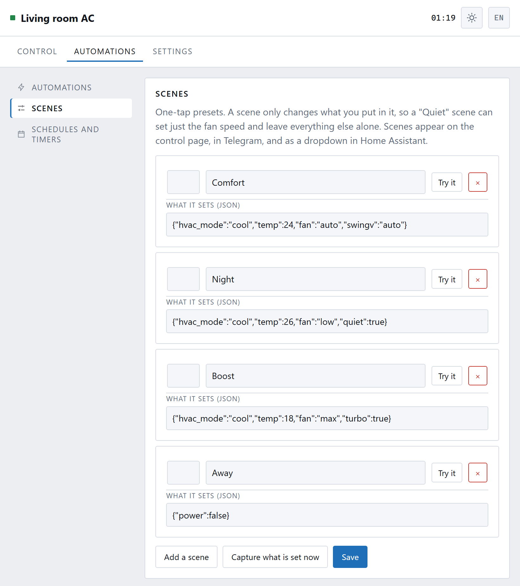
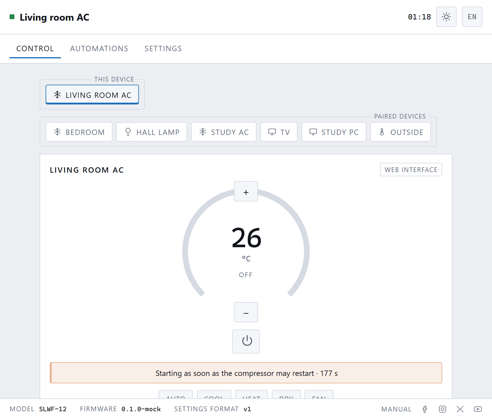
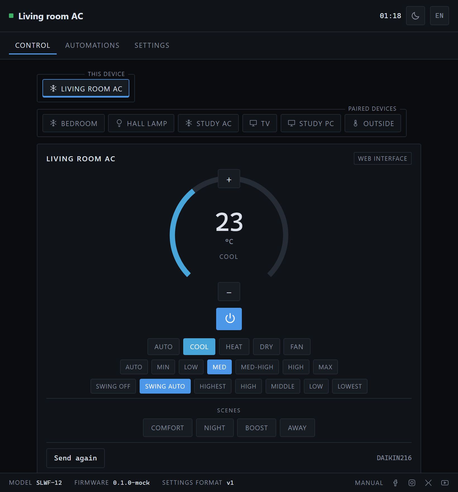
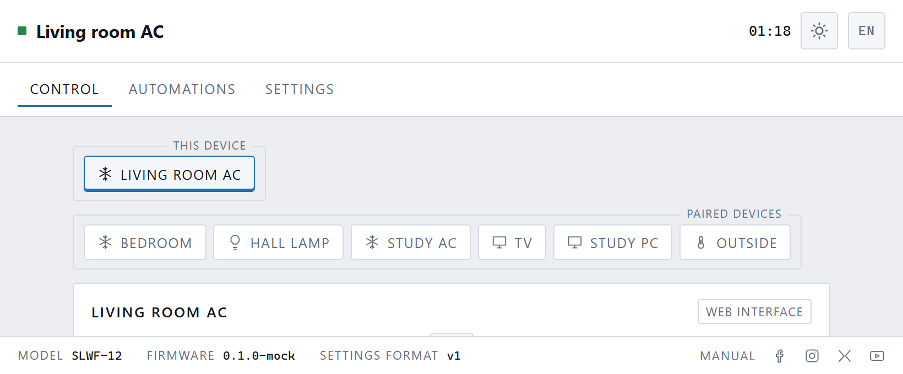
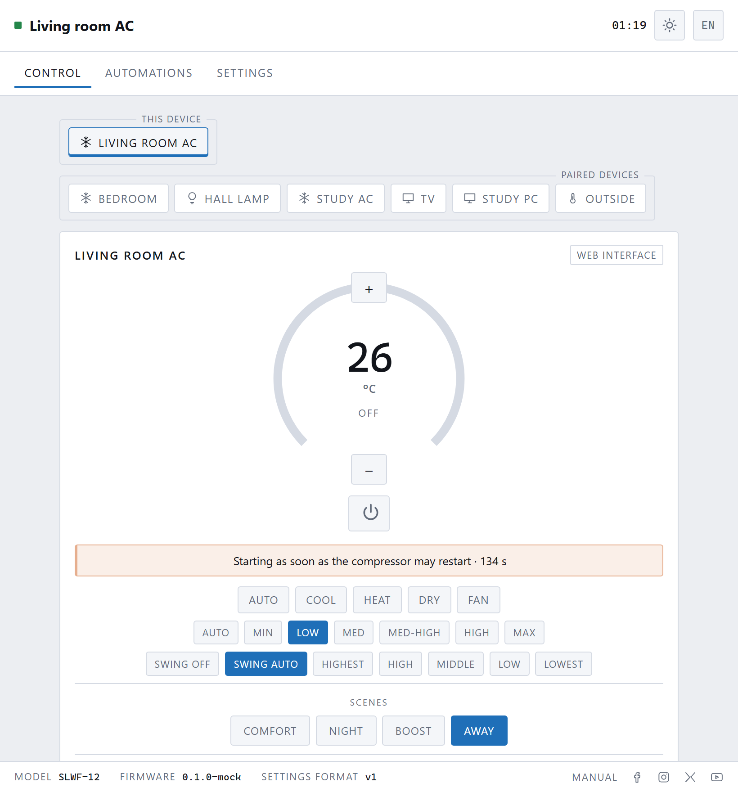

[← 2. Teaching](02-teaching.md) · **3. Everyday use** · [4. Your TV remote →](04-other-remotes.md)

# Everyday use

## The dial

The big number is the **target temperature** — what you are asking for, not what
the room is. The box has no thermometer; the air conditioner does.

**+** and **−** change it by half a degree at a time (or whole degrees in
Fahrenheit, and you can change the step on the Air conditioner page). The
coloured arc fills as the target moves through the range your unit allows, and
takes the colour of the mode: blue for cool, orange for heat, green for dry,
grey for fan, purple for auto.

The word under the number is the mode, or **OFF**.

## The controls

**The power button** switches the unit on and off.

**The first row** is the mode: auto, cool, heat, dry, fan. Not every unit has
all five; asking for one it lacks does nothing.

**The second row** is fan speed, from auto through min to max. Again, your unit
may have fewer.

**The third row** is the swing — which way the flap points, or whether it moves.

Below a dividing line are **scenes**, which are yours, not the air
conditioner's. More on those in a moment.

Every change is sent the instant you make it. There is no "apply".

## The label at the top right

That pill says **who last changed something** — the web interface, Home
Assistant, a schedule, or "the air conditioner's own remote" if somebody picked
up the handset. It is how you tell whether the box did something or merely
noticed something.

## Send again

Bottom left, under a line. Infrared is one-way: the box has no way of knowing
whether the unit heard. If somebody walked through the beam at the wrong moment,
or the unit was off at the wall, press **Send again** and it repeats the current
settings.

The grey text beside it is the protocol in use, which is only interesting when
something is wrong.

## Scenes

A scene is a set of settings under one name.

Four come with the box — Comfort, Night, Boost, Away — and you can change them
or add your own under **Automations → Scenes**.

A scene changes **only what is in it**. A "Quiet" scene containing nothing but
fan = low will drop the fan speed and leave the temperature and mode exactly as
they were. This is more useful than it sounds: it lets you build scenes that
compose rather than fight.

**Capture what is set now** builds a scene from however the unit is set at this
moment, which is much easier than filling in the fields by hand.

Scenes appear on the control page, in Telegram, as a dropdown in Home Assistant,
and can be triggered by a button on your TV remote.

## When it makes you wait

Switch the unit off and straight back on and you will see this. The compressor
needs time for its pressure to equalise; starting it too soon is how they fail
early.

Your request is **not lost**. The box is holding it, counting down, and will
send it the moment the wait is over. Nothing needs pressing again.

Change the wait — or turn it off, if your unit protects itself — on the
Air conditioner page.

## Following the handset

The box listens as well as talks. Use the original remote and the page catches
up within a second or so, and says the change came from the remote.

This is the one thing an infrared bridge can do that a wired one has to work
for, and it has one limit worth knowing: it only hears presses that happen while
it is plugged in and in range. If somebody uses the handset while the box is
unplugged, the page will be confidently wrong until it hears the remote again or
you send something yourself.

## Light and dark

The sun/moon button in the top right cycles **auto → light → dark**. Auto
follows your phone or computer, including switching itself at sunset if your
system does that.

## More than one device

If you have paired anything — another SLWF unit, a light, a computer — a strip
of tabs appears above the card, with **this device** in its own box and the rest
in another. Tap one to control it.

With nothing paired the strip is hidden entirely, because one device is not a
choice. See [Other devices](06-other-devices.md).

## Another language

The **EN** button in the top right goes to the language page. English is built
in; other languages are downloaded once and then kept on the device. See
[Settings](08-settings.md).

---

Next: **[Using your TV remote →](04-other-remotes.md)**
