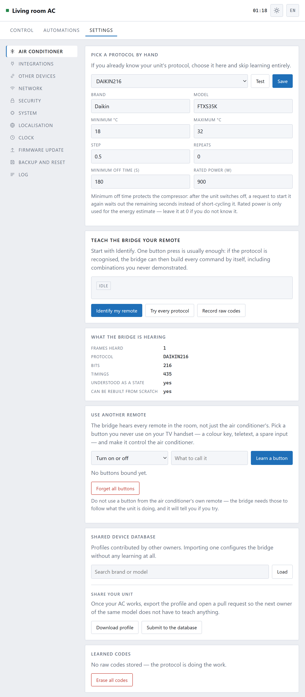

[← 3. Everyday use](03-everyday-use.md) · **4. Your TV remote** · [5. Automations →](05-automations.md)

# Using your TV remote

The box hears **every** infrared remote in the room, not only the air
conditioner's. So a button you never press on a handset you already own can be
made to work the air conditioner.

Most people have a spare button without realising: a coloured key, teletext, an
input you do not use, the button for a device you no longer own.

It is on **Settings → Air conditioner**, in the card called **Use another
remote**.

## Binding a button

1. Choose what the button should **do** from the dropdown.
2. Give it a name you will recognise later — "red key on the TV remote".
3. Press **Learn a button**.
4. Point that remote at the box and press the button you have chosen.

It appears in the list, and works from then on. No pairing, no batteries, no app
— the box was already listening.

## What a button can do

| | |
|---|---|
| **Turn on or off** | Toggles. One button, both jobs |
| **Turn on** / **Turn off** | Only ever one direction |
| **Warmer** / **Cooler** | One step at a time, like + and − |
| **Next mode** | Cycles auto → cool → heat → dry → fan |
| **Next fan speed** | Cycles through the speeds |
| **Swing on or off** | Toggles the flap |
| **Apply a scene** | Choose which scene when you bind it |
| **Send again** | Repeats the current settings, for when the unit missed one |

**Apply a scene** is the one worth planning around. One button for "Night" —
cool, 26°, low fan, quiet — is faster than any app, and works when the Wi-Fi is
down, when the phone is charging in another room, and for people in the house
who would rather not be issued with an app.

## Do not use the air conditioner's own remote

The box will stop you, and the reason is worth knowing.

Those buttons are how it follows what the unit is doing. Bind one and every
press would mean two things at once — "the unit was just told something" and
"do this other thing" — and the two would fight.

Use the TV handset, the one from the old stereo, or a cheap universal remote.

## When a button seems not to work

**Nothing happened.** Point the *other* remote at the box, not at the air
conditioner. It has to hear the button; the air conditioner does not.

**It works sometimes.** The box has to be in the beam. A remote pointed at the
TV, with the box off to one side, will be heard only when the signal bounces
back off something.

**One press does it twice.** Remotes repeat while held. The box ignores repeats
for a short window after each press, so a firm tap is better than a hold.

**It stopped working after you changed something on the TV.** Some remotes
change their codes when you switch them to a different device mode. Bind the
button again with the handset in the mode you normally leave it in.

## Removing bindings

Each row has a **×**. **Forget all buttons** clears the lot, which is the
quickest way to start again if you have bound something by accident.

---

Next: **[Timers, schedules and automations →](05-automations.md)**
