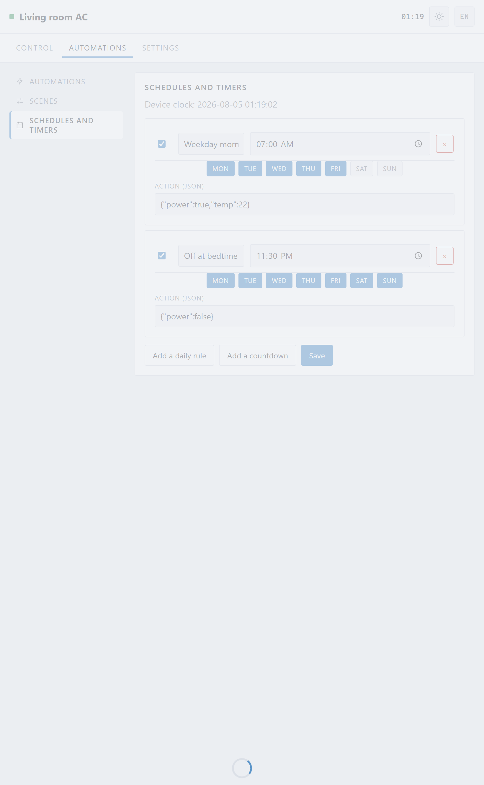
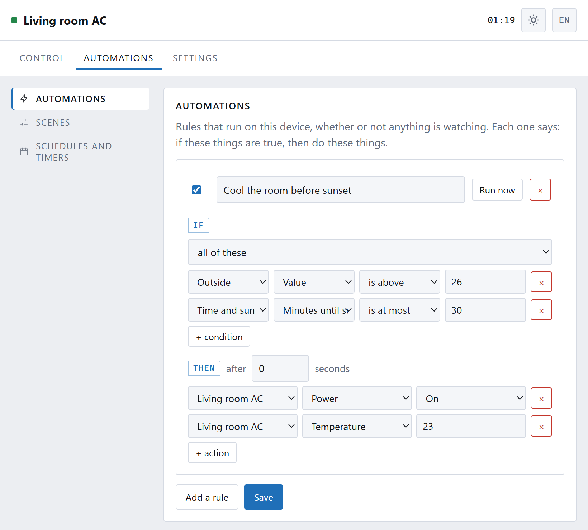

[← 4. Your TV remote](04-other-remotes.md) · **5. Automations** · [6. Other devices →](06-other-devices.md)

# Timers, schedules and automations

Everything in this chapter runs **on the box itself**. Not in the cloud, not on
your phone, not in Home Assistant. It keeps working at three in the morning with
the internet down and every phone in the house asleep.

The **Automations** tab has three pages.

---

## Scenes

A scene is a set of settings under one name, and the building block for
everything else. Covered in [Everyday use](03-everyday-use.md#scenes).

The thing to remember: a scene changes **only what is in it**. Leave the fan
field empty and applying the scene will not touch the fan.

**Capture what is set now** fills a scene from the current settings — much
easier than typing them.

---

## Schedules and timers

Two kinds:

**A daily rule** happens at a time, on the days you choose. "Weekday mornings,
07:00, on at 22°."

**A countdown** happens once, a set number of minutes from when you make it.
"Off in 45 minutes" — the sleep timer, without trusting the one in the unit.

Both need the box to know what time it is. It has no battery, so it starts each
power-up knowing nothing; the browser sets its clock the first time you open the
page. See [Settings → Clock](08-settings.md#clock).

The day buttons start on Monday or Sunday according to your **Week starts**
setting.

---

## Automations

Where schedules do something *at a time*, an automation does something *when
something is true*. Each rule reads:

> **IF** these things are true, **THEN** do these things.

### Building one

Press **Add a rule** and fill in the sentence.

**IF** takes one or more conditions, joined by **all of these** (every one must
be true) or **any of these** (one is enough). Each condition is: a thing, one of
its values, a comparison, and a number or setting to compare against.

**THEN** takes one or more actions, each aimed at a device.

The **after … seconds** box makes the conditions hold for that long before
anything happens. Useful when a reading flickers: "hotter than 26 **for two
minutes**" ignores the moment the sun catches the sensor.

### What can be tested

Anything paired, plus two built-in things:

**This air conditioner** — power, mode, temperature, fan, swing.

**Time and sun** — this is where the clock lives, and it is easy to miss:

| | |
|---|---|
| **Time of day** | A clock face. `is 08:00` is true for that minute |
| **Day of week** | Monday, Tuesday… |
| **Sun** | `is up` or `is down` |
| **Minutes until sunset** | `is at most 30` means "in the half hour before sunset" |
| **Minutes until sunrise** | Goes negative after it has happened, so `is at least -60` means "within an hour after sunrise" |

Sunrise and sunset are worked out on the box from your latitude and longitude
(**Settings → Clock → Location**), with no network involved. This matters more
than it first appears: sunset moves by roughly two hours between June and
December, so "half an hour before sunset" means something different every week —
and "20:00" does not.

**Paired devices** — whatever each one reports. A WLED light reports whether it
is on and how bright; a Home Assistant sensor reports its value.

### What can be done

Anything paired can be told anything it accepts: this air conditioner's power,
mode, temperature, fan and swing; a light's brightness, colour and effect; a
computer's **Wake**; an ESPHome button's press.

### A worked example

The rule in the screenshot says:

> **IF** Outside is above 26° **AND** sunset is at most 30 minutes away,
> **THEN** switch the air conditioner on and set it to 23°.

Which is: cool the room ready for the evening, but only on days hot enough to
need it, and at the right time of year rather than a fixed hour.

### Two things the engine does for you

**A rule fires once.** It runs when the conditions *become* true, not repeatedly
while they stay true. Without this, "if it is warm, turn the fan up" would walk
the fan to maximum in five seconds.

**A rule cannot loop.** If two rules trigger each other, the box notices —
six firings in thirty seconds — and puts them to sleep for five minutes rather
than hammering the air conditioner. It says so in the log.

**Run now** tests a rule immediately, ignoring its conditions. Much easier than
waiting for sunset to find out you had the comparison backwards.

---

## Which one should I use?

| You want | Use |
|---|---|
| The same settings every weekday morning | a **schedule** |
| Off in 45 minutes | a **countdown** |
| One tap for "the way I like it at night" | a **scene** |
| Something to happen because a *condition* changed | an **automation** |
| The lamp to come on when the air conditioner does | an **automation** |

---

Next: **[Other devices →](06-other-devices.md)**
