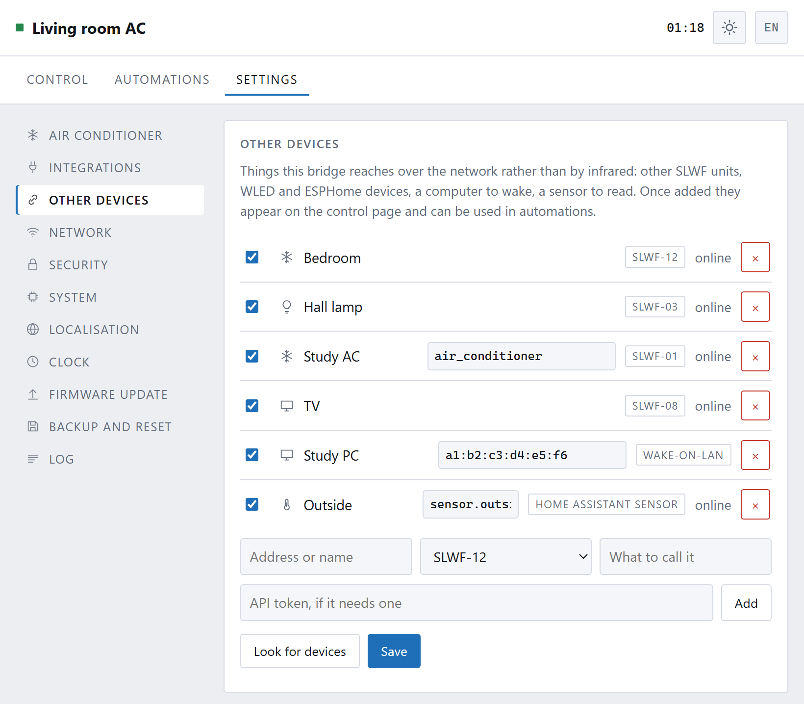

[← 5. Automations](05-automations.md) · **6. Other devices** · [7. Connecting →](07-connecting.md)

# Other devices

The box can reach other things on your network and put them on the same page,
so one bookmark works the whole room. They can also be used in
[automations](05-automations.md).

**Settings → Other devices.**

These are things reached over **the network**, not by infrared. The air
conditioner this box is pointed at is not in this list — it is the box's own
job, and lives on the Control page.

## What can be added

| Type | What it is |
|---|---|
| **SLWF-12** | Another one of these, in another room |
| **SLWF-03, SLWF-09, SLWF-11** | WLED light controllers |
| **SLWF-01** | The ESPHome air conditioner bridge — the wired one |
| **SLWF-08** | The ESPHome HDMI-CEC controller |
| **Wake-on-LAN** | A computer to wake up |
| **Home Assistant sensor** | Any value from Home Assistant — outdoor temperature, for instance |
| **JSON value (any URL)** | A number from anything on your network that serves JSON |

## Adding one

**Look for devices** searches your network and lists what it finds. This asks
your local network only; nothing leaves the house.

Or type it in: an address (`192.168.1.51` or `bedroom-ac.local`), the type, and
a name of your choosing. Some types need one more detail, and the form asks for
it by name:

- an **ESPHome** device needs its entity id, e.g. `air_conditioner`
- a **Wake-on-LAN** target needs the computer's MAC address, e.g.
  `a1:b2:c3:d4:e5:f6` — a sleeping machine has no address of its own, so the
  MAC is how it is reached
- a **Home Assistant sensor** needs the entity, e.g.
  `sensor.outside_temperature`, and a long-lived token in the API token box

Press **Add**, then **Save**.

The switch at the left of each row turns a device off without removing it. The
**×** removes it.

## What they look like once added

They appear as tabs on the Control page.

- **Another SLWF-12** gets exactly the same thermostat card as the local one —
  dial, modes, fan, swing, send again.
- **An SLWF-01** gets the same card too, because it is also an air conditioner.
- **A light** gets its own controls: on/off, brightness, a colour picker, and
  the effect number.
- **A computer** gets one button: **Wake**.
- **A sensor** shows what it last read. There is nothing to press.

## Wake-on-LAN, briefly

Waking a computer over the network needs three things, and only one of them is
here:

1. **This box** — add the machine, give it the MAC address, press Wake.
2. **The computer's network card** must be allowed to wake the machine. In
   Windows this is in the adapter's Power Management properties; on a desktop it
   is often also a BIOS setting called "Wake on LAN" or "Power on by PCI-E".
3. **The computer must be on the same network** — a magic packet is a broadcast
   and does not cross routers.

If it does not work, it is almost always the second one.

## Why the box does this, and not your browser

The box talks to these devices itself. That is what lets an automation say "when
the air conditioner comes on, light the lamp" and have it work at three in the
morning with every phone in the house asleep.

Credentials for those devices — tokens, passwords — stay on the box and are
never sent back to the page.

## Adding a type that is not listed

The list of device types is a **file**, not something built into the firmware.
`devicetypes.json` describes what each kind of device is, where to reach it, and
what it can be asked or told. Supporting something new means adding an entry to
that file — no firmware change, no rebuild.

That is a job for someone comfortable with JSON, and the file is documented in
the repository.

---

Next: **[Connecting it to things →](07-connecting.md)**
