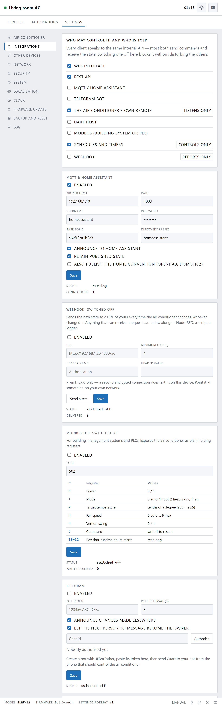

[← 6. Other devices](06-other-devices.md) · **7. Connecting** · [8. Settings →](08-settings.md)

# Connecting it to things

**Settings → Integrations.**

## Everything is off until you ask

Out of the box the only things switched on are the web interface, the REST API,
the infrared paths, and schedules and automations. MQTT, Telegram, Modbus, UART
and the compatibility endpoints are all off.

That is deliberate. A door that is open because nobody thought about it is worse
than one you chose to open. Nothing here starts working until you switch it on.

## Who may control it

The list at the top is one switch per client. They all speak to the same thing
inside the box, so turning one off blocks it without disturbing the others.

| | |
|---|---|
| **Web interface** | This page. Leave it on |
| **REST API** | Plain web requests, and anything built on them |
| **MQTT / Home Assistant** | |
| **Telegram bot** | |
| **The air conditioner's own remote** | *Listens only* — it can never be told anything |
| **UART host** | A cable to another controller |
| **Modbus** | Building systems and PLCs |
| **Schedules and timers** | *Controls only* |
| **Webhook** | *Reports only* — it is told things, it never tells |

Switch **Schedules and timers** off and every schedule stops firing without
being deleted. Useful when you go away.

---

## Home Assistant

The easiest one, because there is nothing to configure at the Home Assistant
end.

1. Switch on **MQTT & Home Assistant**.
2. Fill in your broker's address, and a username and password if it needs them.
3. Leave **Announce to Home Assistant** ticked.
4. Save.

Within a few seconds a thermostat appears in Home Assistant by itself, along
with a dropdown for scenes, a sensor for running hours, and a button to resend.
No YAML.

**Retain published state** means Home Assistant sees the right values as soon as
it starts, rather than waiting for the next change.

**Also publish the Homie convention** is for openHAB and Domoticz. Leave it off
unless you use one.

The status line underneath says whether the connection is actually working,
which is the first thing to look at if the thermostat never appears.

## Telegram

Control the air conditioner by message, from anywhere.

1. In Telegram, message **@BotFather** and ask for a new bot. It gives you a
   token.
2. Paste the token here and switch Telegram on. Save.
3. Leave **Let the next person to message become the owner** ticked, and send
   `/start` to your new bot from the phone that should control the unit.

That phone is now the owner. Untick the setting so nobody else can claim it.

The bot understands plain instructions — `on`, `off`, `22`, `cool`, `night`,
`status` — and can tell you when something changes, whoever changed it.

Telegram needs the internet, and it is the only part of the box that does.

## Webhooks

Every time the air conditioner changes, the box sends the new state to a URL of
yours. Anything that can receive a web request can follow along: Node-RED, a
script, a spreadsheet, a logger.

**Minimum gap** stops a flurry of changes becoming a flurry of requests.

Plain `http://` only, pointed at something on your own network. Encrypted
connections cost more memory than this chip has to spare while doing everything
else.

## Modbus

For building management systems and PLCs. The air conditioner appears as plain
holding registers; the table on the page lists them.

## The compatibility endpoints

Two extra ways in, both off by default, at the bottom of the page:

**Tasmota commands** — `/cm?cmnd=Power%20Toggle`, for software that already
speaks Tasmota.

**Prometheus metrics** — `/api/metrics`, for graphing.

While off they answer 404, and they are not listed as addresses to try.

## For an AI assistant

There is an MCP server in the repository, under `tools/mcp/`. It runs on your
own computer and lets an assistant read and change the air conditioner through
the same API everything else uses — including a read-only mode where it can look
but not touch.

It is not part of the firmware, and the box has nothing extra listening for it.
See `tools/mcp/README.md`.

---

Next: **[Settings →](08-settings.md)**
