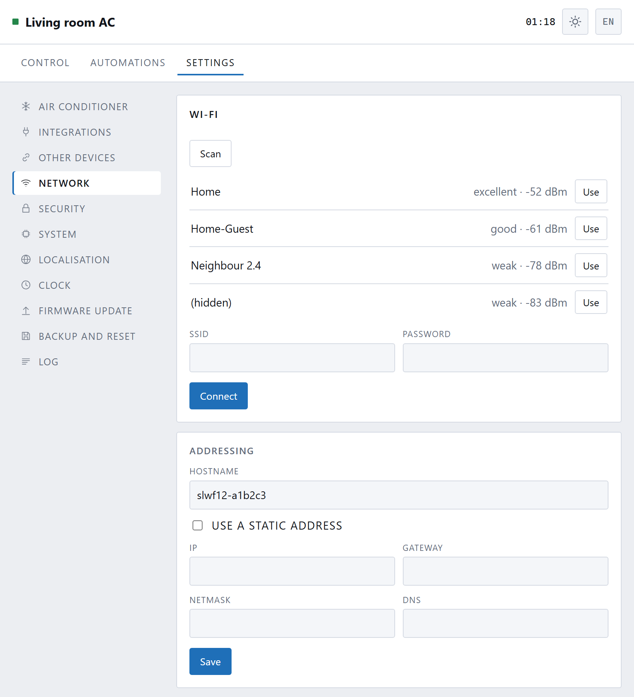
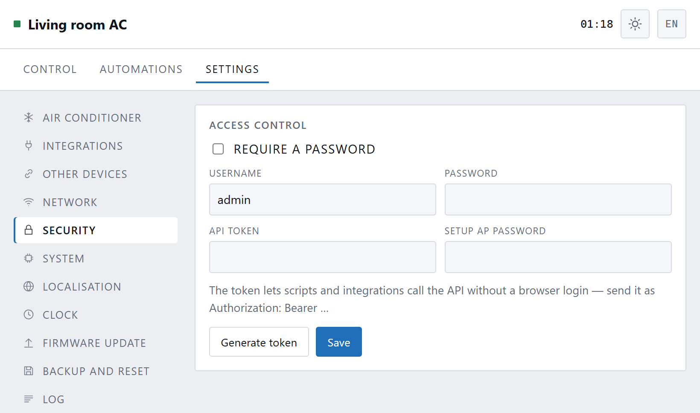
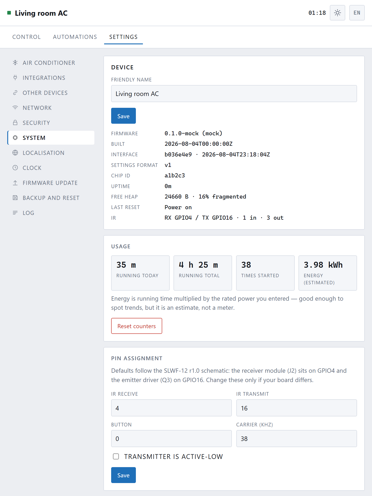
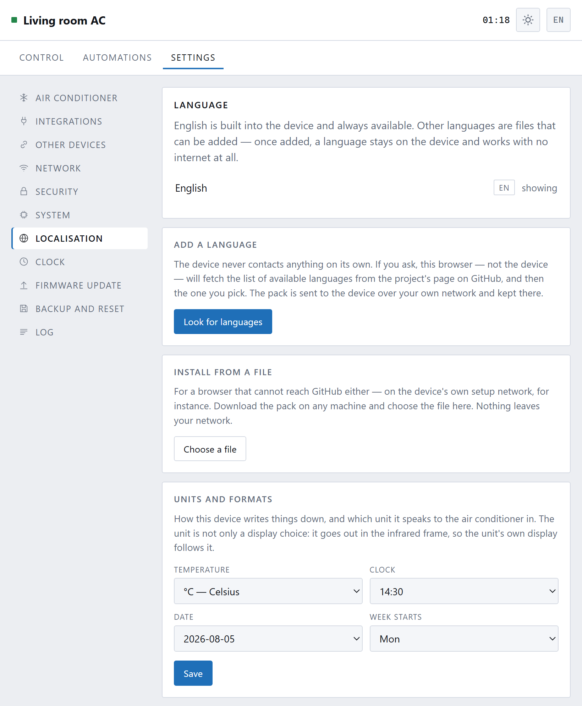
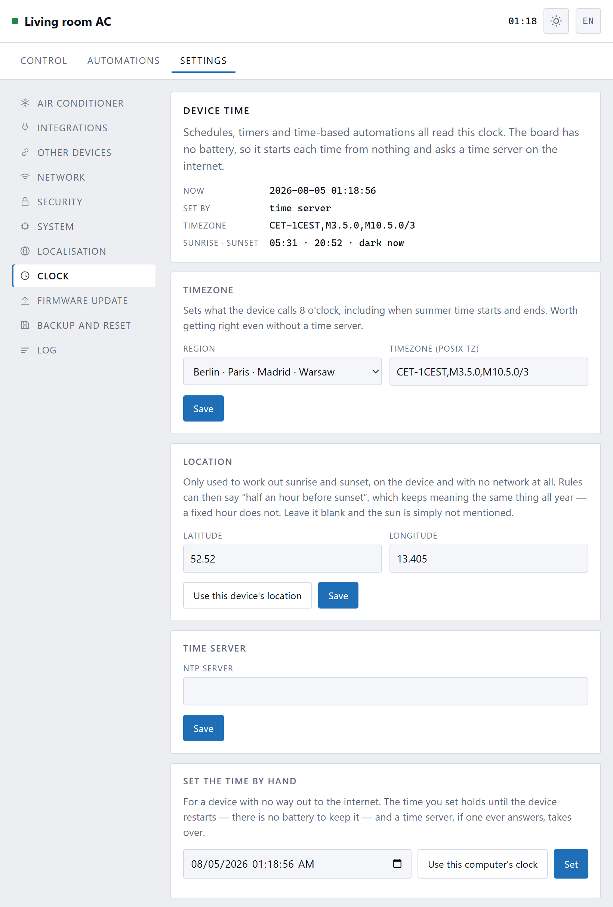
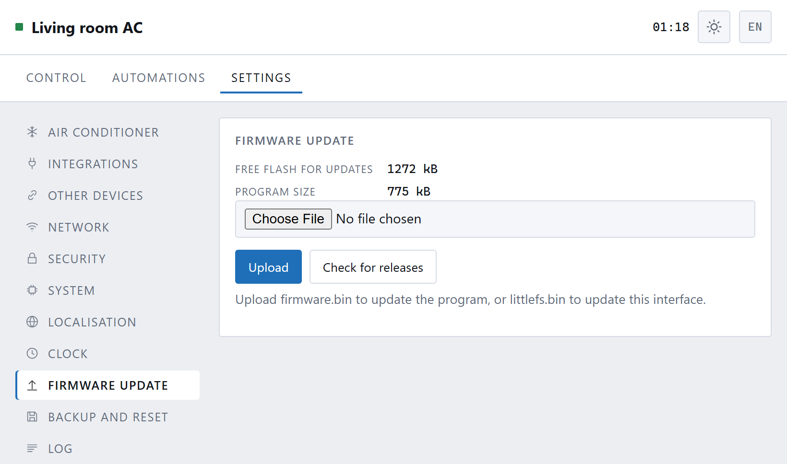
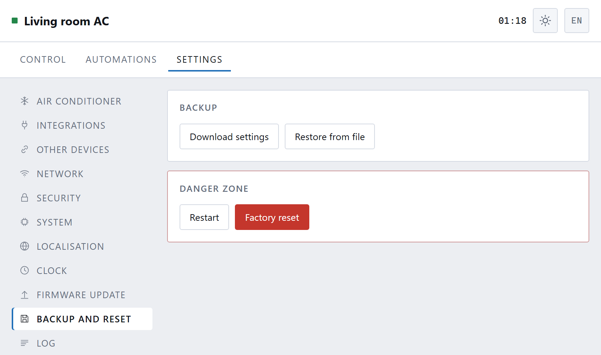
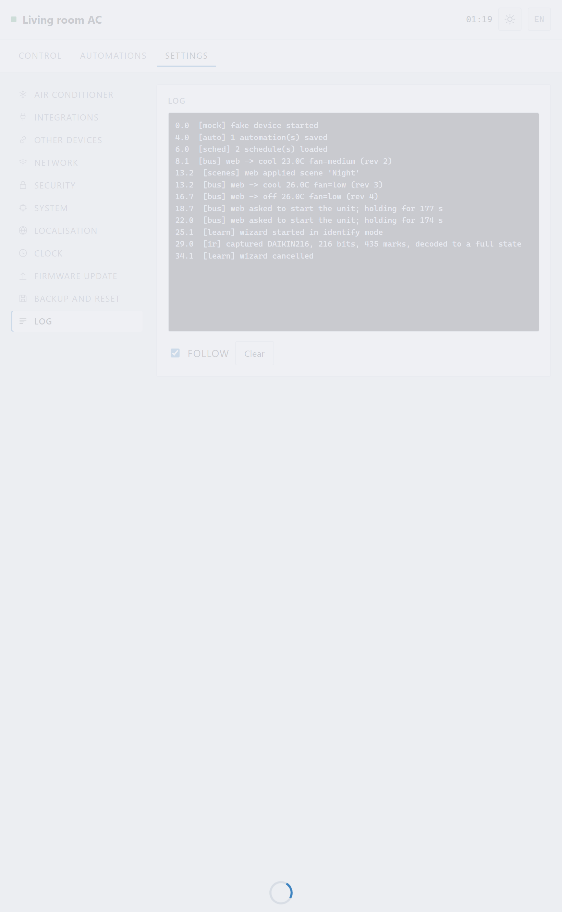

[← 7. Connecting](07-connecting.md) · **8. Settings** · [9. Troubleshooting →](09-troubleshooting.md)

# Settings

The **Settings** tab has a menu down the left. Each page is one subject, and
everything on a page is visible at once — there is nothing folded away.

- [Air conditioner](02-teaching.md) — teaching, protocol, temperature range,
  compressor protection
- [Other devices](06-other-devices.md) — things on your network
- [Integrations](07-connecting.md) — who may control it
- **Network** — Wi-Fi
- **Security** — who may open this page
- **System** — usage, pins, diagnostics
- **Localisation** — language, units, date and time formats
- **Clock** — timezone, location, setting the time
- **Firmware update**
- **Backup and reset**
- **Log**

---

## Network

Which Wi-Fi it is on, how strong the signal is, and the address it can be
reached at.

**Hostname** is the `slwf12-a1b2c3` part of the address. Change it to something
memorable — `ac-livingroom` gives you `http://ac-livingroom.local`.

A **static address** is available if you would rather your router did not decide.
Most people should leave this alone; a wrong static address makes the box
unreachable and the only way back is the button.

---

## Security

Out of the box, **anyone on your Wi-Fi can control the air conditioner**. For
most homes that is the right default: the people on your Wi-Fi are the people in
your house.

Switch on **Require a password** if that is not true — a shared flat, an office,
a rental, or a guest network that is not as separate as you assumed.

Set a username and a password and the page will ask for them.

The **API token** is for programs rather than people: Home Assistant, a script,
the MCP server. Anything holding the token can control the box, so treat it like
a password, and press **Generate** for a new one if it ever gets out.

Changing these does not lock you out of the box itself — the button on the case
still resets everything.

---

## System

**Device** — the name shown at the top of the page and in Home Assistant, and
the version information underneath.

**Usage** — how long the air conditioner has run today and in total, how many
times it has started, and an energy estimate. The estimate is running time
multiplied by the rated power you entered on the Air conditioner page: good
enough to spot a trend, not a meter. It is omitted entirely if you have not
entered a wattage.

**Pin assignment** — which pins the infrared receiver and transmitter are on.
The defaults match the board. Do not change these unless you have built
something yourself.

---

## Localisation

### Language

English is built into the device and always there. Every other language is a
file that can be added — and once added it stays on the device and works with no
internet at all.

**The device never contacts anything on its own.** Press **Look for languages**
and *your browser* — not the box — fetches the list from the project's page on
GitHub. It says so before it does it. Pick one, and the browser downloads it and
sends it to the box over your own network, where it stays.

If the browser cannot reach GitHub either — on the box's own setup network, for
instance — download the file on any computer and use **Install from a file**.
Nothing leaves your network.

Any language except English can be removed. English cannot, because it is what
everything else falls back to.

### Units and formats

| | |
|---|---|
| **Temperature** | °C or °F |
| **Clock** | 14:30 or 2:30 pm |
| **Date** | 2026-08-05, 05/08/2026 or 08/05/2026 |
| **Week starts** | Monday or Sunday |

The temperature unit is **not only a display choice**. The unit travels in the
infrared signal, so the air conditioner's own display follows it. Switching to
Fahrenheit converts what you have asked for — 24 °C becomes 75 °F, the same
temperature, not the number 24 in a different unit.

The range you set on the Air conditioner page stays in Celsius. You set it once,
in whichever unit you think in, and the other one is worked out.

---

## Clock

Schedules, timers and anything to do with sunrise need the box to know the time.
It has no battery, so it starts each power-up knowing nothing.

**Device time** shows what it currently believes, and how it was told.

**Timezone** — pick your region from the list, which fills in the technical
string beside it. Anywhere not listed can be typed in by hand.

**Location** — a latitude and longitude, used only to work out sunrise and
sunset, on the device, with no network at all. **Use this device's location**
asks your browser. Leave it blank and the sun is simply never mentioned.

**Time server** — empty by default, and the box asks nobody. Your browser sets
the clock the first time it opens the page, which is enough for something
somebody looks at now and then. Name a server and the box will keep itself
synchronised instead, which is worth doing if it runs untouched for months.

**Set the time by hand** — for a device with no way out to the internet at all.
The time you set holds until it restarts.

---

## Firmware update

Two files, and the difference matters:

- **firmware.bin** is the program.
- **littlefs.bin** is this web interface.

Choose a file and press Upload; the box works out which one it is. It restarts
by itself and comes back in twenty seconds or so.

**Your settings survive both.** Wi-Fi details, the taught air conditioner,
scenes, schedules and automations all live in a part of the flash that neither
update touches.

There is a third file in the releases, **slwf12-factory.bin**, which is both
images in one. Use it when flashing a new board over USB. Do **not** use it to
update a device in service — it would erase everything.

**Check for releases** asks GitHub whether there is a newer version. It only
happens when you press it.

---

## Backup and reset

**Download settings** saves everything to a file: the configuration, the taught
air conditioner, scenes, schedules, automations, paired devices. Worth doing
once you have it working.

Passwords are **not** in the file. You will need to type the Wi-Fi password
again after restoring.

**Restore from file** puts it all back.

**Restart** does what it says. **Factory reset** erases everything and returns
the box to its setup network, exactly as it came.

You can also factory reset from the box itself: hold the button for ten seconds.
That is the way back in if you have forgotten the password or made it
unreachable.

---

## Log

What the box has been doing. Useful when something is not working, and worth
copying into any question you ask.

It is kept in memory, not written to flash, and clears itself on restart. The
box only sends it to the page while you are looking at this page.

---

Next: **[When something is wrong →](09-troubleshooting.md)**
